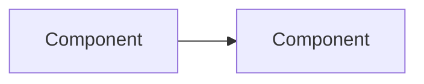

# BuildBook — Learn a Project, Write a Book

A reusable prompt for AI assistants to study any codebase and produce a self-contained HTML learning book with LaTeX math, Mermaid diagrams, exercises, and a polished reading experience.

## How to use

1. Open your project in an AI-assisted editor (Copilot, Claude, Cursor, etc.)
2. Paste or reference the prompt below
3. The assistant will study the codebase, write chapters as markdown files in `learn/chapters/`, and build `learn/book.html`

---

## The Prompt

Copy everything below the line and give it to your AI assistant.

---

```text
You are an expert technical writer and software architect. Your task is to deeply
study this project's codebase and produce a complete, beginner-friendly learning
book as a self-contained HTML file.

## PHASE 1 — Study the codebase

Before writing anything, thoroughly read and understand:
- README, CONTRIBUTING, and any architecture/design docs
- Entry points and main orchestration files
- Configuration and environment model
- Core data structures and type definitions
- All major modules and their responsibilities
- Test files (to understand expected behavior)
- Build scripts, CI, deployment files
- Security boundaries and trust models

Build a mental dependency graph of the entire system.

## PHASE 2 — Plan the book structure

Create a chapter outline that follows these principles:
- Start with orientation and mental models (what is this? why does it exist?)
- Move to language/framework prerequisites specific to this codebase
- Cover setup and first run early (readers need quick wins)
- Then go module-by-module through the architecture, ordered by dependency
  (things that depend on nothing first, things that depend on everything last)
- End with testing, security, operations, and production readiness
- Target 12-20 chapters depending on project complexity

Each chapter MUST include:
- A clear learning objective (what the reader will understand after)
- At least one Mermaid diagram (flowchart, sequence, state, or ER diagram)
- At least one LaTeX equation that models some aspect of the system
  (throughput, latency, probability, coupling metric, queue theory, etc.)
  — the math should illuminate the engineering, not be decorative
- An exercise at the end that asks the reader to explore actual code

## PHASE 3 — Write chapters

Create a `learn/chapters/` directory. Write each chapter as a markdown file:

  NN-slug-name.md

Where NN is the zero-padded chapter number (01, 02, ...).

### Chapter markdown format

```markdown
# Chapter NN — Title Here

Opening paragraph that sets context and motivation.

## Section heading

Body text with `inline code`, **bold**, and *italic*.

## Diagram: descriptive label



## Concept with math

$$
\text{metric} = \frac{\text{numerator}}{\text{denominator}}
$$

Inline math like $p$ is also supported.

- Bullet points for lists
- More items

1. Numbered lists
2. Work too

Exercise: a specific task asking the reader to explore real code in the project.
```

### Rules for chapter content
- Write for someone who has never seen the codebase
- Be concrete: reference actual filenames, function names, type names
- Explain WHY things are designed the way they are, not just WHAT they do
- Every diagram must reflect real code structure, not abstract theory
- Every equation must connect to an observable system property
- Keep chapters focused — one major concept per chapter
- Use blockquotes (> ) for important callouts

## PHASE 4 — Create the build script

Create `learn/build-book.ps1` (PowerShell) that:

1. Reads all `learn/chapters/*.md` files in sorted order
2. Converts markdown to HTML with a custom converter that handles:
   - Headings (h1/h2/h3)
   - Code fences (with language detection)
   - Mermaid code blocks → `<pre class='mermaid'>` in a styled wrapper
   - Display math blocks (`$$` on own line) → `<div class="math-block">$$...$$</div>`
     (CRITICAL: buffer multi-line math into a single element, do NOT split into <p> tags)
   - Inline formatting (bold, italic, code, links)
   - Ordered and unordered lists
   - Blockquotes
   - Lines starting with "Exercise:" → styled callout boxes
3. Extracts chapter numbers and titles from `# Chapter NN — Title` headings
4. Generates a single `learn/book.html` with all chapters

### CRITICAL build script requirements

- Use a LITERAL here-string (`@'...'@`) for the HTML template, NOT an expandable
  one (`@"..."@`). PowerShell expands `$$` as an automatic variable in expandable
  strings, which destroys KaTeX delimiters and causes infinite browser loops.
- Use placeholder tokens (like `__TOC__` and `__SECTIONS__`) and `.Replace()` to
  inject dynamic content into the literal template.
- Write the file as UTF-8 without BOM.

## PHASE 5 — Design the HTML

The generated `book.html` must be:

### Layout
- Sidebar + content grid layout (collapses to single column on mobile)
- Sticky sidebar with table of contents
- Active chapter highlighting in ToC as user scrolls
- Smooth scroll navigation

### Visual design
- Book cover header with gradient background, title, subtitle, chapter count
- Large decorative chapter numbers (watermark style)
- Accent-colored section headings with bottom border
- Dark theme code blocks with language badges
- Math blocks in subtle colored containers
- Mermaid diagrams in light background cards
- Exercise callouts with green left border and icon
- Reading progress bar at top of page
- Light/dark mode via prefers-color-scheme
- Print stylesheet that hides navigation

### Typography
- Serif font for titles (Georgia/Cambria)
- System sans-serif for body
- Monospace for code (Cascadia Code/Fira Code/Consolas)
- Comfortable line-height (1.65-1.75)

### Dependencies (CDN only, no build tools)
- KaTeX CSS + JS + auto-render (loaded synchronously at end of body)
- Mermaid ESM module (loaded as type=module, with manual `.run()` call)
- No other dependencies

### KaTeX configuration
```javascript
renderMathInElement(document.body, {
  delimiters: [
    { left: '$$', right: '$$', display: true },
    { left: '$',  right: '$',  display: false },
    { left: '\\(', right: '\\)', display: false },
    { left: '\\[', right: '\\]', display: true }
  ],
  throwOnError: false,
  ignoredTags: ['script','noscript','style','textarea','pre','code']
});
```

## PHASE 6 — Build and verify

Run the build script and verify:
- All chapters render without errors
- Math equations display correctly (no raw $$ visible)
- Mermaid diagrams render (no raw mermaid text visible)
- ToC navigation works
- Dark mode works
- No infinite loops or browser hangs
- Exercise callouts are styled

## Output structure

```
learn/
  README.md          # Brief description of the book and build instructions
  build-book.ps1     # PowerShell build script
  book.html          # Generated output (self-contained)
  chapters/
    01-slug.md
    02-slug.md
    ...
```

Begin by studying the codebase thoroughly, then proceed through all phases.
```
