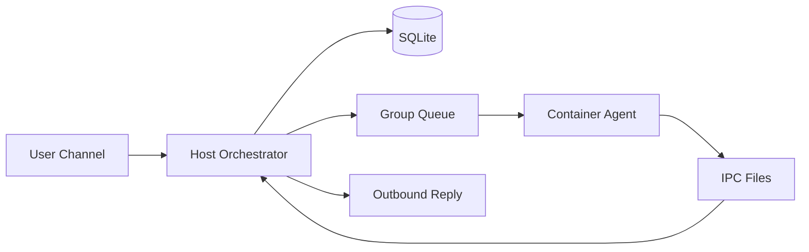

# Chapter 01 — NanoClaw Orientation and Learning Path

NanoClaw is a host orchestrator that receives channel messages, executes Claude agents in isolated containers, and routes replies back to users. The host process is the authority layer; containers are execution workers with constrained filesystem access. This book starts with mental models first, then implementation details.

## What you should understand after this chapter

- What lives in host code vs container code
- Why group isolation is central to safety
- Which folders to read first
- How one message flows at a high level

## Diagram: bird’s-eye architecture

## Minimal vocabulary

- **Channel adapter**: translates platform events to internal messages.
- **Orchestrator**: startup, polling, queueing, routing.
- **Group folder**: per-group workspace and memory.
- **IPC**: file-based host/container communication.

Exercise: open `src/index.ts`, `src/channels/whatsapp.ts`, and `src/container-runner.ts`, then write one sentence for each file’s purpose.
