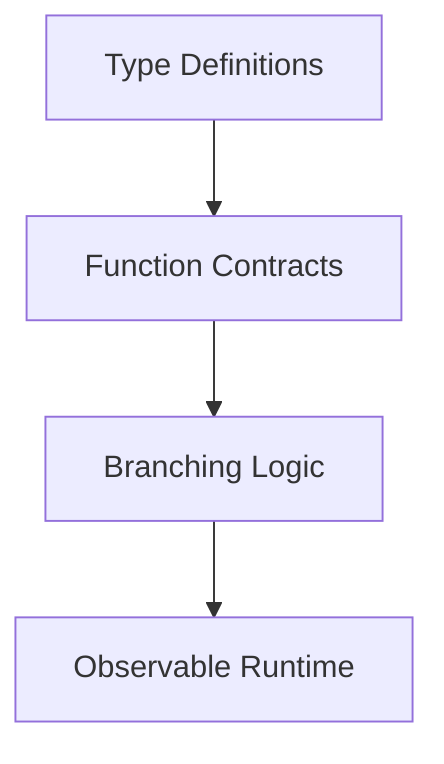

# Chapter 02 — TypeScript Essentials for This Repo

You do not need “all TypeScript” to work effectively here. You need a small subset: interfaces, optional fields, async/await, and safe narrowing of uncertain values. NanoClaw uses these patterns repeatedly across orchestrator, scheduler, and channel modules.

## Core patterns in this codebase

- `interface` contracts between modules (`Channel`, `ScheduledTask`)
- `Record<string, T>` maps for state (`sessions`, cursors)
- Optional members (`setTyping?`) and optional chaining (`obj?.x`)
- Async pipelines with `Promise` and `await`

## Diagram: types to runtime behavior

## Useful mental equation

$$
\text{confidence} = \frac{\text{typed paths validated}}{\text{paths modified}}
$$

If you touch 5 paths and validate 2, your confidence is low.

## Beginner checklist before editing

1. Find interface/type used by the function.
2. Find tests touching that code path.
3. Confirm nullable/optional fields are handled.
4. Run targeted tests first.

Exercise: pick one function in `src/router.ts`, list its input type, output type, and one failure case.
