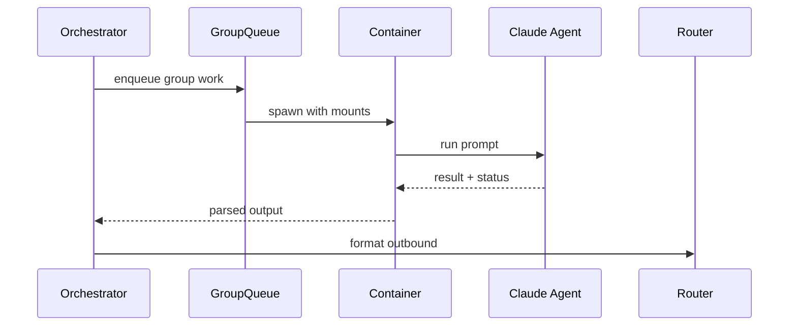

# Chapter 03 — How Claude Agents Work in NanoClaw

NanoClaw does not run Claude in the host process. It spawns a containerized runner per group/task context. The host prepares prompt/context, mounts allowed folders, and consumes structured outputs. This separation limits blast radius and keeps authority in host code.

## Agent lifecycle in practice

- Host receives or schedules work
- Host prepares snapshots (tasks/groups/context)
- Container runner starts with controlled mounts
- Agent emits result/status/session updates
- Host persists state and routes user-visible output

## Diagram: orchestrator to agent sequence

## Reliability model

$$
P(\text{success by }k) = 1 - (1-p)^k
$$

Where $p$ is single-attempt success probability.

Exercise: trace where session IDs are loaded and saved in `src/index.ts`.
