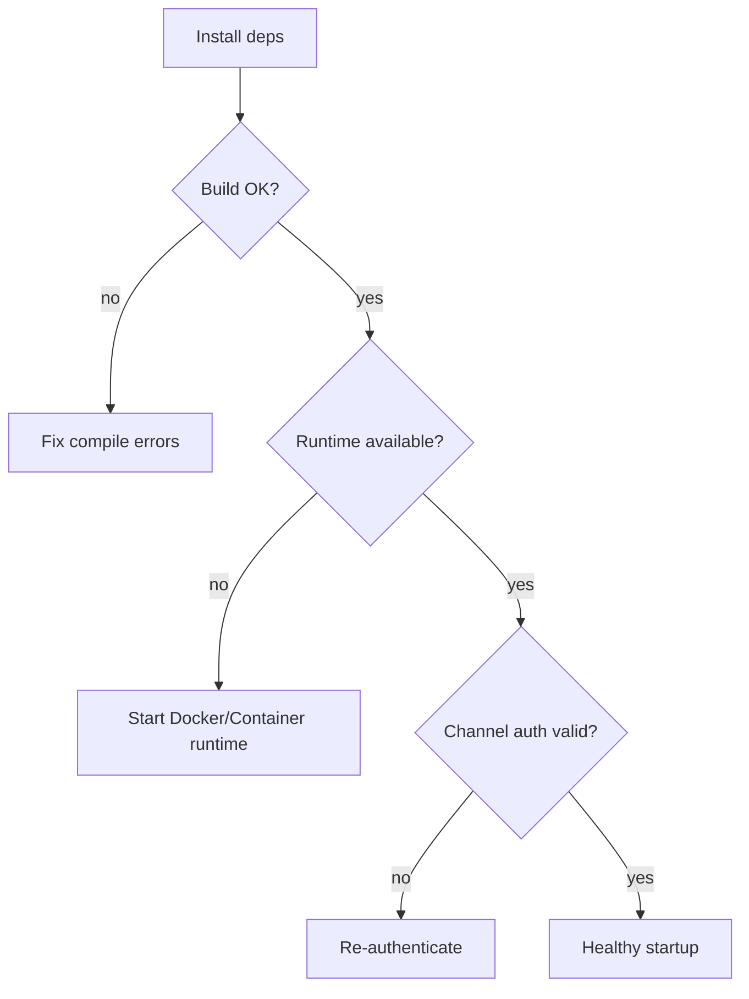

# Chapter 04 — Local Setup and First Safe Run

This chapter turns setup into a deterministic process. The goal is to avoid “it works on one machine” surprises. You will validate prerequisites, startup sequence, and first healthy message loop.

## Setup sequence

1. Install dependencies (`npm ci`)
2. Build (`npm run build`) or run dev (`npm run dev`)
3. Ensure container runtime is available
4. Authenticate channel (WhatsApp flow)
5. Verify logs and group registration

## Diagram: setup decision tree

## Operational metric

$$
A = \frac{\text{successful startups}}{\text{startup attempts}}
$$

Track this during onboarding.

Exercise: define your own “healthy startup” checklist with 5 log signals.
