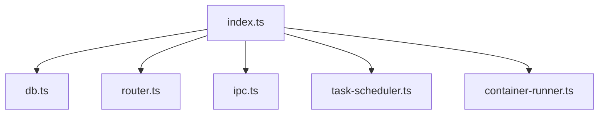

# Chapter 06 — Architecture Deep Dive: Orchestrator Components

The orchestrator coordinates channels, persistence, scheduling, IPC, and container execution. Think in boundaries: each module should own one responsibility.

## Module map

- `src/index.ts`: startup and main loop
- `src/router.ts`: message formatting/routing
- `src/ipc.ts`: task/message IPC watcher
- `src/db.ts`: schema and data access
- `src/task-scheduler.ts`: periodic task orchestration

## Diagram: dependency map

## Coupling intuition

$$
R = \frac{E_{inter}}{E_{total}}
$$

Lower $R$ generally means simpler maintenance.

Exercise: identify one boundary where adding a helper function would reduce coupling.
