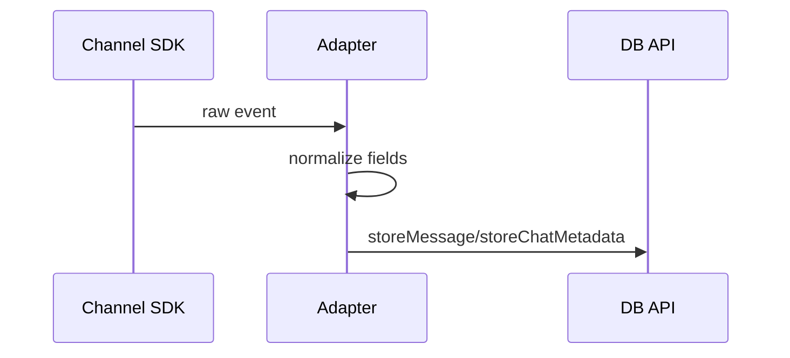

# Chapter 07 — Channel Intake and Message Normalization

Channel adapters turn platform-specific payloads into NanoClaw’s internal message shape. Normalization is where many production bugs start.

## Key outcomes

- Understand inbound extraction path in channel adapter
- Normalize content/timestamps/sender safely
- Separate transport quirks from core logic

## Diagram: inbound normalization sequence

## Error-rate metric

$$
 e = \frac{N_{invalid}}{N_{total}}
$$

Reduce $e$ with strict normalization and fallback handling.

Exercise: inspect one inbound branch in `src/channels/whatsapp.ts` and list optional fields that can be missing.
