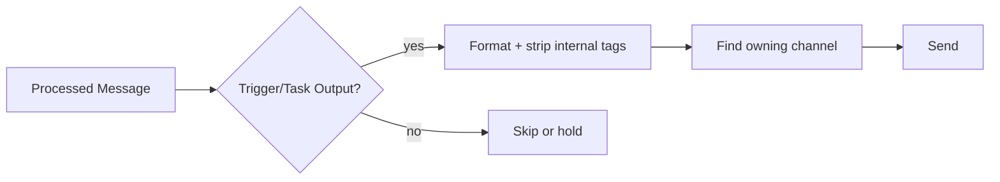

# Chapter 08 — Routing and Outbound Response Path

Routing decides where responses go and what content is visible to users. Keep decision logic separate from formatting logic.

## Learnings

- Trigger-based processing vs normal conversational flow
- Outbound sanitization (`formatOutbound` path)
- Channel lookup and ownership checks

## Diagram: outbound routing branches

## Throughput framing

$$
\lambda_{out} \approx \min(\lambda_{in}, \mu)
$$

Outgoing rate cannot exceed system service rate $\mu$.

Exercise: add a temporary log field to routing and verify one full outbound path.
