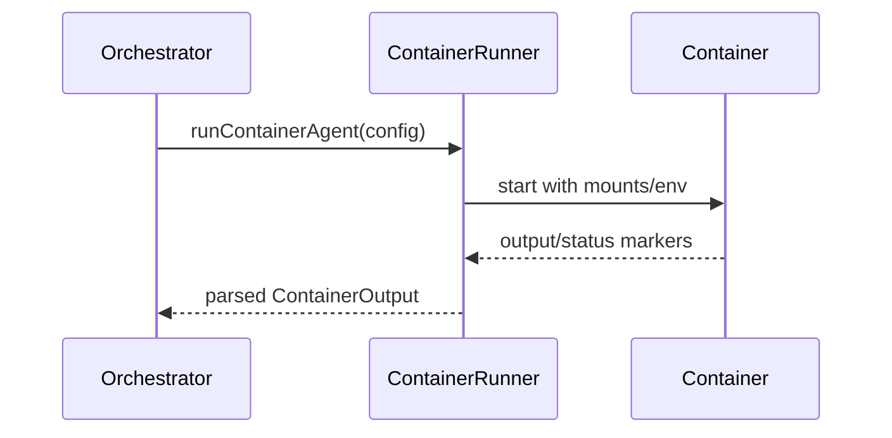

# Chapter 09 — Container Runtime and Agent Execution

Containers are execution sandboxes, not authority boundaries. Host remains source of truth; containers run scoped work.

## Understand

- How container spawn is parameterized
- Why mounts are constrained per group
- How output markers are parsed back into host state

## Diagram: container spawn lifecycle

## Latency budget

$$
L_{total} = L_{queue} + L_{exec} + L_{io}
$$

Exercise: inspect container logs for one run and map each phase to this equation.
