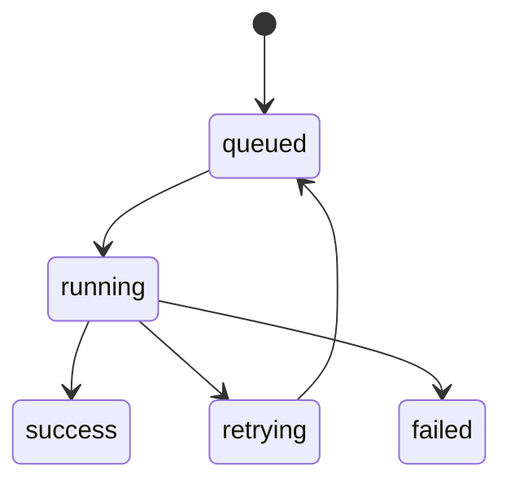

# Chapter 10 — IPC and Task Processing Loop

IPC loop polls task/message files, validates requests, and applies host-authorized actions.

## Learn

- Folder-based source identity model
- Task processing stages and idempotency concerns
- Retry/backoff behavior for transient issues

## Diagram: task state machine

## Backoff formula

$$
 t_n = t_0 2^n
$$

Exercise: trace one IPC task from file creation to completion using logs and DB state.
