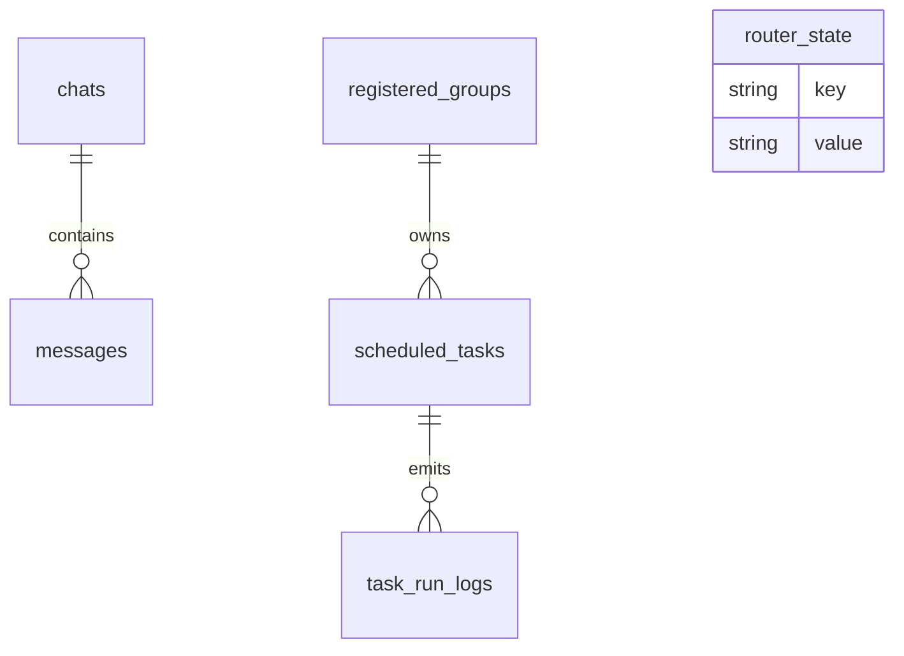

# Chapter 11 — SQLite State and Data Models

SQLite stores chat/message history, routing cursors, sessions, registered groups, and scheduled tasks.

## Focus

- Which tables are operationally critical
- Why cursor/session state must persist correctly
- How query patterns influence reliability

## Diagram: persistence model

## Queue intuition

$$
L = \lambda W
$$

Little’s Law helps reason about backlog under load.

Exercise: run a query that lists newest message timestamp per group and compare with router cursor state.
