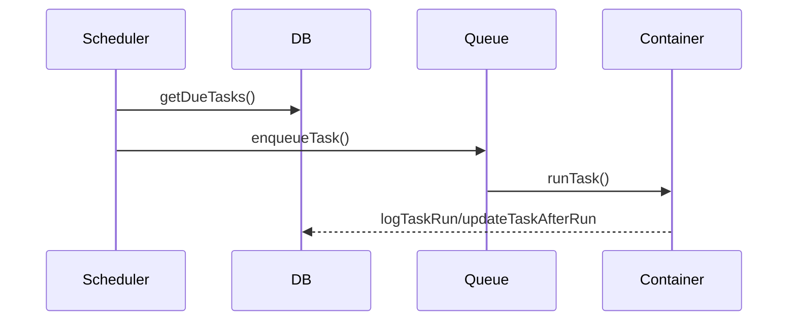

# Chapter 12 — Scheduler and Periodic Workloads

Scheduler scans due tasks and enqueues execution through the same queue/container model.

## What to master

- Due-task detection and status transitions
- Cron vs interval vs once semantics
- How scheduler interacts with queue limits

## Diagram: scheduled execution flow

## Utilization equation

$$
\rho = \frac{\lambda}{\mu}
$$

Keep $\rho$ below 1 for stable queues.

Exercise: configure one low-risk periodic task and verify its run logs over two cycles.
