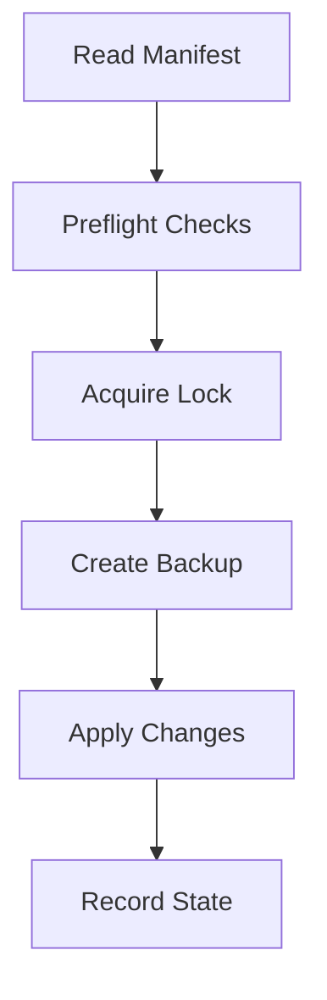

# Chapter 13 — Skills System and Customization Workflow

Skills are structured modifications with manifests, dependency checks, conflict checks, and rollback behavior.

## Learn

- How skill manifests define adds/modifies/dependencies
- Why lock + backup + state recording is mandatory
- How customization sessions protect long-lived forks

## Diagram: skill pipeline

## Conflict intuition

$$
P_{conflict} \propto n \cdot d
$$

More touched files ($n$) and drift ($d$) increase conflict risk.

Exercise: inspect one skill manifest and explain two safety checks before apply.
