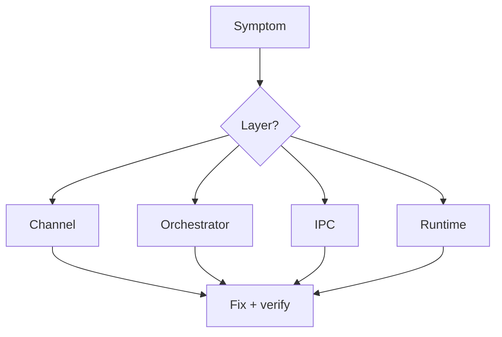

# Chapter 14 — Testing, Debugging, and Observability

Start narrow, then widen. Debugging and tests are feedback loops, not separate activities.

## Key habits

- Run focused tests first for changed paths
- Use structured logs to localize layer failures
- Confirm fix with targeted reproduction before broad suite

## Diagram: triage path

## Flake metric

$$
F = \frac{N_{nondeterministic\ failures}}{N_{runs}}
$$

Exercise: pick one failing path and write a 3-step reproducible debug procedure.
