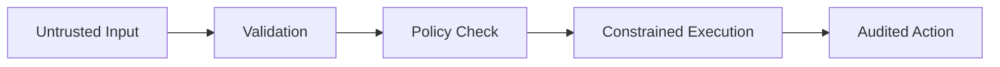

# Chapter 15 — Security and Isolation Principles

Security here is mostly boundary discipline: validate untrusted input, enforce mount restrictions, and keep authorization in host code.

## Principles

- Least privilege for mounts and capabilities
- Path canonicalization before allowlist checks
- No trust in container-provided claims without host validation

## Diagram: trust pipeline

## Risk model

$$
R = P(\text{exploit}) \times I(\text{impact})
$$

Exercise: review one code path for trust-boundary crossing and list its validations.
