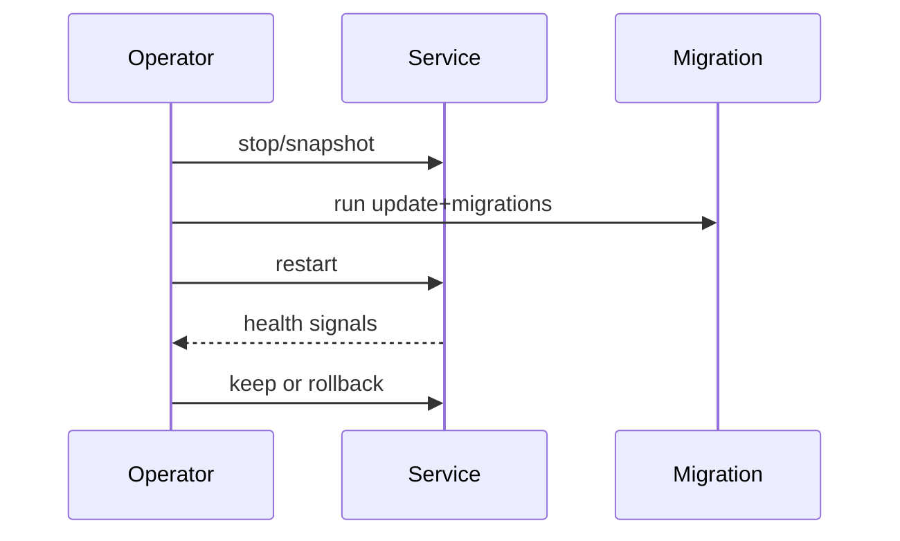

# Chapter 16 — Operations, Updates, and Production Readiness

Production-readiness means predictable startup, safe updates, and fast recovery.

## Outcome goals

- Operate service lifecycle confidently
- Apply updates/migrations with rollback awareness
- Monitor core reliability indicators

## Diagram: update cycle

## Availability framing

$$
\text{SLO} = 1 - \frac{\text{downtime}}{\text{total time}}
$$

Exercise: write a mini runbook with pre-update checks, rollback trigger, and post-update verification.
